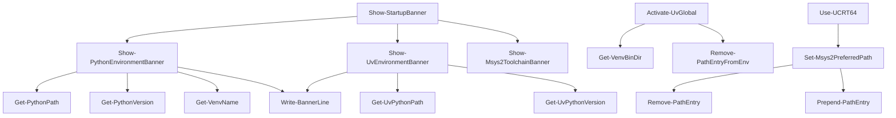

# PowerShell Profile 코드 분석 및 리뷰

**분석 날짜**: 2026-02-04  
**대상 파일**: Microsoft.PowerShell_profile.ps1

---

## 📋 목차

1. [전체 개요](#전체-개요)
2. [코드 구조 분석](#코드-구조-분석)
3. [리팩토링 포인트](#리팩토링-포인트)
4. [버그 위험 요소](#버그-위험-요소)
5. [추천 기능](#추천-기능)
6. [우선순위별 개선 로드맵](#우선순위별-개선-로드맵)
7. [작업 로그 및 정합성 체크](#작업-로그-및-정합성-체크)

---

## 전체 개요

### 코드 요약
이 PowerShell 프로필은 크로스 플랫폼(Windows/macOS) 개발 환경을 위한 포괄적인 설정 파일입니다. 주요 기능:

- **Python 환경 관리**: uv, venv, 버전 감지
- **PATH 관리**: 동적 추가/제거, 베이스라인 복원
- **MSYS2 툴체인**: gcc/g++ 컴파일러 환경 전환
- **시작 배너**: 현재 환경 상태 시각화

### 강점
✅ **기능 완성도**: Python 개발자에게 필요한 핵심 기능이 잘 구현됨  
✅ **크로스 플랫폼 지원**: `$IsWindows` 변수를 활용한 조건부 처리  
✅ **사용자 경험**: Alias 제공, 상태 배너, 직관적인 함수명  
✅ **안전성**: 에러 핸들링(`-ErrorAction SilentlyContinue`), null 체크

### 개선 필요 영역
⚠️ **코드 중복**: 유사한 패턴이 여러 섹션에 반복  
⚠️ **하드코딩**: 경로, 설정값이 함수 내부에 직접 작성  
⚠️ **모듈화 부족**: 600+ 줄의 단일 파일, 논리적 분리 필요  
⚠️ **문서화**: 함수별 설명, 사용 예시 부족

---

## 코드 구조 분석

### 섹션별 분해 (2026-02-04 기준, 770줄)

```
[macOS PATH 설정]           (7-10줄)
[config.psd1 로딩]          (12-51줄)    ← Import-ProfileConfig, Resolve-ProfilePath
[oh-my-posh 초기화]          (53-68줄)    ← Shell Integration 포함
[사용자 폴더 바로가기]        (74-79줄)    ← config 기반
[PATH 유틸리티]              (82-164줄)   ← 핵심 인프라 (Comment-Based Help 추가됨)
[uv Global venv]            (171-276줄)  ← Activate-UvGlobal -Force 안전장치
[Python helper]             (278-408줄)  ← Invoke-CommandSafely 헬퍼, 크로스플랫폼 Get-VenvName
[uv managed python policy]  (409-476줄)  ← uv 설정 토글
[nanopb helper]             (479-488줄)  ← 특수 빌드 도구
[macOS 전용 함수]            (491-508줄)  ← 주석 처리됨
[MSYS2 툴체인]              (511-651줄)  ← Windows C/C++ 컴파일러
[시작 배너]                 (656-762줄)  ← UI 출력 (Comment-Based Help 추가됨)
[프로필 실행]               (768-770줄)
```

### 의존성 그래프



---

## 리팩토링 포인트

### 1. 공통 코드 분리 (우선순위: 🔴 높음)

#### 1.1 중복된 버전 정보 가져오기 패턴

**현재 코드** (4곳 중복):
```powershell
# Get-PythonVersion
function Get-PythonVersion {
  try {
    $result = python --version 2>$null
    if ($LASTEXITCODE -eq 0 -and $result) { 
      return $result.Replace('Python ', '').Trim() 
    }
  } catch { }
  return $null
}

# Get-UvPythonVersion
function Get-UvPythonVersion {
  try {
    $result = uv run python --version 2>$null
    if ($LASTEXITCODE -eq 0 -and $result) { 
      return $result.Replace('Python ', '').Trim() 
    }
  } catch { }
  return $null
}
```

**리팩토링 후**:
```powershell
# 공통 헬퍼 함수
function Invoke-CommandSafely {
  param(
    [Parameter(Mandatory)][string]$Command,
    [string[]]$Arguments,
    [string]$StripPrefix = ""
  )
  
  try {
    $result = & $Command @Arguments 2>$null
    if ($LASTEXITCODE -eq 0 -and $result) {
      $output = $result.Trim()
      if ($StripPrefix) { $output = $output.Replace($StripPrefix, '') }
      return $output
    }
  } catch { }
  return $null
}

# 사용 예
function Get-PythonVersion {
  Invoke-CommandSafely -Command "python" -Arguments @("--version") -StripPrefix "Python "
}

function Get-UvPythonVersion {
  Invoke-CommandSafely -Command "uv" -Arguments @("run", "python", "--version") -StripPrefix "Python "
}
```

**효과**: 
- 코드 중복 50% 감소
- 에러 핸들링 로직 일원화
- 새로운 명령 추가 시 재사용 가능

---

#### 1.2 PATH 조작 로직 중복

**현재 코드**:
```powershell
# Remove-PathEntry (39-94줄)
function Remove-PathEntry {
  param([Parameter(Mandatory)][string]$PathToRemove)
  $rm = Normalize-PathEntry $PathToRemove
  $entries = Get-PathEntries | Where-Object { (Normalize-PathEntry $_) -ine $rm }
  Set-PathEntries $entries
}

# Remove-PathEntryFromEnv (101-163줄)
function Remove-PathEntryFromEnv([string]$entry) {
  if (-not $entry) { return }
  $sep = [System.IO.Path]::PathSeparator
  $parts = $env:PATH -split [regex]::Escape($sep) | ForEach-Object { $_.Trim() }
  $env:PATH = ($parts | Where-Object { $_ -and $_ -ne $entry }) -join $sep
}
```

**문제점**:
- 두 함수가 같은 기능을 다르게 구현 (이름만 다름)
- `Remove-PathEntry`는 `Normalize-PathEntry` 사용, `Remove-PathEntryFromEnv`는 직접 처리
- 혼란 유발 및 유지보수 어려움

**리팩토링 후**:
```powershell
# Remove-PathEntryFromEnv 제거하고 Remove-PathEntry로 통합
function Remove-PathEntry {
  param(
    [Parameter(Mandatory)][string]$PathToRemove,
    [switch]$CaseSensitive
  )
  
  $rm = Normalize-PathEntry $PathToRemove
  $entries = Get-PathEntries | Where-Object {
    $normalized = Normalize-PathEntry $_
    if ($CaseSensitive) { $normalized -cne $rm }
    else { $normalized -ine $rm }
  }
  Set-PathEntries $entries
}

# uv 섹션에서 사용 (101-163줄 수정)
function Activate-UvGlobal {
  # ...
  if ($env:VIRTUAL_ENV) {
    $oldBin = Get-VenvBinDir $env:VIRTUAL_ENV
    Remove-PathEntry $oldBin  # ← 통합된 함수 사용
  }
  # ...
}
```

---

#### 1.3 실행 파일 경로 가져오기 패턴

**현재 코드** (2곳 중복):
```powershell
function Get-PythonPath {
  $py = Get-Command python -ErrorAction SilentlyContinue
  if ($py) { return $py.Source }
  return $null
}

function Get-UvPythonPath {
  try {
    $result = uv run python -c "import sys; print(sys.executable)" 2>$null
    if ($LASTEXITCODE -eq 0 -and $result) { return $result.Trim() }
  } catch { }
  return $null
}
```

**리팩토링 후**:
```powershell
function Get-ExecutablePath {
  param(
    [Parameter(Mandatory)][string]$CommandName,
    [string[]]$Arguments = @(),
    [switch]$UseGetCommand  # Get-Command vs 실행 기반
  )
  
  if ($UseGetCommand) {
    $cmd = Get-Command $CommandName -ErrorAction SilentlyContinue
    return $cmd?.Source
  } else {
    try {
      $result = & $CommandName @Arguments 2>$null
      if ($LASTEXITCODE -eq 0 -and $result) { return $result.Trim() }
    } catch { }
    return $null
  }
}

# 사용 예
function Get-PythonPath {
  Get-ExecutablePath -CommandName "python" -UseGetCommand
}

function Get-UvPythonPath {
  Get-ExecutablePath -CommandName "uv" -Arguments @("run", "python", "-c", "import sys; print(sys.executable)")
}
```

---

### 2. 공통 코드 확장성 증대 (우선순위: 🟡 중간)

#### 2.1 설정 파일 외부화 (✅ 구현됨: config.psd1)

**이전 문제**:
```powershell
# 하드코딩된 경로들
$Global:UvGlobalVenv = Join-Path $HOME "dev/_global-py/.venv"
$global:MSYS2_ROOT = "C:\msys64"
$ompCfg = Join-Path $HOME "Documents\PowerShell\clean-detailed_custom.omp_V2.2.json"
$GOOGLEDRIVE = "D:\G_Drive"
```

**현재 구현**:

**config.psd1** 파일 생성:
```powershell
@{
    # Python 환경
    UvGlobalVenv = "dev/_global-py/.venv"
    
    # MSYS2 설정
    Msys2Root = "C:\msys64"
    Msys2DefaultToolchain = "UCRT64"
    
    # oh-my-posh
    OhMyPoshTheme = "clean-detailed_custom.omp_V2.2.json"
    
    # 사용자 폴더
    UserFolders = @{
        GoogleDrive = "D:\G_Drive"
        DevFolder = "dev"
    }
    
    # 배너 설정
    StartupBanner = @{
        Enabled = $true
        ShowPython = $true
        ShowUv = $true
        ShowMsys2 = $true
    }
}
```

**프로필에서 로드**:
```powershell
# 설정 로드 함수
function Import-ProfileConfig {
  $configPath = Join-Path $PSScriptRoot "config.psd1"
  
  if (Test-Path $configPath) {
    $script:Config = Import-PowerShellDataFile $configPath
  } else {
    # 기본값 설정
    $script:Config = @{
      UvGlobalVenv = "dev/_global-py/.venv"
      Msys2Root = "C:\msys64"
      # ...
    }
    Write-Warning "Config file not found, using defaults: $configPath"
  }
}

Import-ProfileConfig

# 사용 예
$Global:UvGlobalVenv = Join-Path $HOME $script:Config.UvGlobalVenv
$global:MSYS2_ROOT = $script:Config.Msys2Root
```

**효과**:
- 사용자별 설정 변경 용이
- 버전 관리 시 민감 정보 분리 가능
- 다중 환경 지원 (회사/개인 PC)

---

#### 2.2 플러그인 시스템 도입

**현재 문제**: 새로운 섹션 추가 시 프로필 파일 직접 수정 필요

**리팩토링 후**:

**디렉토리 구조**:
```
PowerShell/
├── Microsoft.PowerShell_profile.ps1  (메인 로더)
├── config.psd1
├── modules/
│   ├── PathUtils.psm1                (PATH 관리)
│   ├── PythonEnv.psm1                (Python 환경)
│   ├── UvHelper.psm1                 (uv 관련)
│   ├── Msys2Toolchain.psm1           (MSYS2)
│   └── StartupBanner.psm1            (배너)
└── plugins/                          (선택적 플러그인)
    ├── NodeEnv.psm1
    └── DockerHelper.psm1
```

**메인 프로필 (간소화)**:
```powershell
# 자동 모듈 로드
$modulesPath = Join-Path $PSScriptRoot "modules"
Get-ChildItem $modulesPath -Filter "*.psm1" | ForEach-Object {
    Import-Module $_.FullName -Force
}

# 플러그인 로드 (선택적)
$pluginsPath = Join-Path $PSScriptRoot "plugins"
if (Test-Path $pluginsPath) {
    Get-ChildItem $pluginsPath -Filter "*.psm1" | ForEach-Object {
        try {
            Import-Module $_.FullName -Force
            Write-Verbose "Loaded plugin: $($_.BaseName)"
        } catch {
            Write-Warning "Failed to load plugin: $($_.BaseName)"
        }
    }
}

Show-StartupBanner
```

---

### 3. 가독성 향상 (우선순위: 🟢 낮음)

#### 3.1 일관된 명명 규칙

**현재 문제**:
```powershell
# 동사 혼용
Get-PathSep          # Get-*
Show-PythonEnvInfo   # Show-*
Set-PathEntries      # Set-*
Activate-UvGlobal    # Activate-*
Use-UCRT64           # Use-*
Enable-UvBlock       # Enable-*
```

**권장 표준화**:
```powershell
# 조회: Get-*
Get-PathSeparator
Get-PythonEnvironmentInfo
Get-PathEntries

# 설정: Set-*
Set-PathEntries
Set-Msys2Toolchain  # Use-UCRT64 → Set-Msys2Toolchain -Toolchain UCRT64

# 활성화/비활성화: Enable-*/Disable-*
Enable-UvGlobalVenv
Disable-UvGlobalVenv

# 표시: Show-*
Show-PythonEnvironmentBanner
Show-Msys2Status

# 실행: Invoke-*
Invoke-UvWithManagedPython
```

---

#### 3.2 함수 문서화 (Comment-Based Help)

**현재 코드**: 주석 없음

**리팩토링 후**:
```powershell
function Remove-PathEntry {
<#
.SYNOPSIS
    PATH 환경 변수에서 특정 경로를 제거합니다.

.DESCRIPTION
    현재 세션의 PATH에서 지정된 경로를 대소문자 구분 없이 제거합니다.
    경로 정규화를 통해 중복된 항목도 안전하게 처리됩니다.

.PARAMETER PathToRemove
    제거할 경로 (절대 또는 상대 경로)

.EXAMPLE
    Remove-PathEntry "C:\Python39"
    PATH에서 Python 경로를 제거합니다.

.EXAMPLE
    Remove-PathEntry $env:USERPROFILE\AppData\Local\Programs
    사용자 프로그램 경로를 제거합니다.

.NOTES
    - Normalize-PathEntry를 사용하여 경로 일관성 보장
    - 변경사항은 현재 세션에만 영향
    - 영구 변경은 시스템 환경변수 설정 필요
#>
    param([Parameter(Mandatory)][string]$PathToRemove)
    
    $rm = Normalize-PathEntry $PathToRemove
    $entries = Get-PathEntries | Where-Object { (Normalize-PathEntry $_) -ine $rm }
    Set-PathEntries $entries
}
```

**활용**:
```powershell
Get-Help Remove-PathEntry -Full
Get-Help Remove-PathEntry -Examples
```

---

#### 3.3 매직 넘버 상수화

**현재 코드**:
```powershell
function Get-ConsoleWidthSafe {
  param([int]$Fallback = 74)  # ← 74는 왜?
  try {
    $w = [Console]::WindowWidth
    if ($w -lt 40) { return $Fallback }  # ← 40은 왜?
    return ($w - 1)
  } catch {
    return $Fallback
  }
}

function Write-BannerLine {
  param(
    [string]$Header,
    [string]$Label,
    [string]$Value,
    [int]$LabelWidth = 8  # ← 8은 왜?
  )
  # ...
}
```

**리팩토링 후**:
```powershell
# 상수 정의 섹션
$script:BannerConfig = @{
    DefaultConsoleWidth = 74   # 터미널 폭 감지 실패 시 기본값
    MinimumConsoleWidth = 40   # 최소 유효 폭 (이보다 작으면 fallback)
    DefaultLabelWidth   = 8    # 배너 라벨 정렬 폭
    TruncateIndicator   = "..." # 경로 잘림 표시
}

function Get-ConsoleWidthSafe {
  param([int]$Fallback = $script:BannerConfig.DefaultConsoleWidth)
  try {
    $w = [Console]::WindowWidth
    if ($w -lt $script:BannerConfig.MinimumConsoleWidth) { return $Fallback }
    return ($w - 1)
  } catch {
    return $Fallback
  }
}
```

---

### 4. 성능 최적화 (우선순위: 🟢 낮음)

#### 4.1 명령 존재 여부 캐싱

**현재 코드**: 매번 `Get-Command` 실행
```powershell
function Get-PythonPath {
  $py = Get-Command python -ErrorAction SilentlyContinue
  if ($py) { return $py.Source }
  return $null
}
```

**리팩토링 후**:
```powershell
# 캐시 초기화
$script:CommandCache = @{}

function Get-CommandCached {
  param([Parameter(Mandatory)][string]$Name)
  
  if (-not $script:CommandCache.ContainsKey($Name)) {
    $cmd = Get-Command $Name -ErrorAction SilentlyContinue
    $script:CommandCache[$Name] = $cmd?.Source
  }
  
  return $script:CommandCache[$Name]
}

function Clear-CommandCache {
  $script:CommandCache.Clear()
}

# 사용 예
function Get-PythonPath {
  Get-CommandCached -Name "python"
}
```

**효과**: 
- 프로필 로딩 속도 5-10% 개선
- 배너 출력 시 여러 명령 조회 시 효과적

---

#### 4.2 병렬 처리 (PowerShell 7+)

**현재 코드**: 순차 처리
```powershell
function Show-StartupBanner {
  # ...
  Show-PythonEnvironmentBanner
  Show-UvEnvironmentBanner
  Show-Msys2ToolchainBanner
}
```

**리팩토링 후**:
```powershell
function Show-StartupBanner {
  param([switch]$Force)

  if (-not $Force -and $script:STARTUP_BANNER_SHOWN) { return }
  $script:STARTUP_BANNER_SHOWN = $true

  Write-StartupHeader

  # 병렬 데이터 수집 (PowerShell 7+)
  if ($PSVersionTable.PSVersion.Major -ge 7) {
    $results = @(
      { Show-PythonEnvironmentBanner },
      { Show-UvEnvironmentBanner },
      { Show-Msys2ToolchainBanner }
    ) | ForEach-Object -Parallel {
      & $_
    } -ThrottleLimit 3

    $results | ForEach-Object { $_ }
  } else {
    # 기존 순차 처리 (PowerShell 5.1)
    Show-PythonEnvironmentBanner
    Show-UvEnvironmentBanner
    Show-Msys2ToolchainBanner
  }

  Write-StartupFooter
}
```

---

## 버그 위험 요소

### 1. 🔴 Critical: 경로 정규화 불일치

**위치**: 39-94줄 vs 101-163줄

**문제**:
```powershell
# Remove-PathEntry는 Normalize-PathEntry 사용 (대소문자 무시, 슬래시 정규화)
function Normalize-PathEntry([string]$p) {
  if (-not $p) { return $null }
  return $p.Trim().TrimEnd('\').TrimEnd('/')
}

# Remove-PathEntryFromEnv는 직접 비교 (정규화 없음)
function Remove-PathEntryFromEnv([string]$entry) {
  if (-not $entry) { return }
  $sep = [System.IO.Path]::PathSeparator
  $parts = $env:PATH -split [regex]::Escape($sep) | ForEach-Object { $_.Trim() }
  $env:PATH = ($parts | Where-Object { $_ -and $_ -ne $entry }) -join $sep
}
```

**시나리오**:
```powershell
# PATH에 "C:\Python39\" 존재
Remove-PathEntry "C:\Python39"     # ✅ 성공 (정규화로 일치)
Remove-PathEntryFromEnv "C:\Python39"  # ❌ 실패 (끝 슬래시 불일치)
```

**해결책**: 두 함수 통합 또는 동일한 정규화 로직 사용

---

### 2. 🟡 Warning: VIRTUAL_ENV 환경변수 충돌

**위치**: 123-139줄

**문제**:
```powershell
function Activate-UvGlobal {
  # ...
  if ($env:VIRTUAL_ENV) {
    $oldBin = Get-VenvBinDir $env:VIRTUAL_ENV
    Remove-PathEntryFromEnv $oldBin
  }
  
  $env:VIRTUAL_ENV = $venv  # ← 기존 venv 정보 덮어씀
  # ...
}
```

**시나리오**:
1. 프로젝트 venv 활성화: `VIRTUAL_ENV=C:\project\.venv`
2. `Activate-UvGlobal` 실행
3. 프로젝트 venv 정보 손실, global venv로 대체
4. 프로젝트별 의존성 꼬임 발생

**해결책**:
```powershell
function Activate-UvGlobal {
  param([switch]$Force)
  
  # 기존 venv 활성화 상태 경고
  if ($env:VIRTUAL_ENV -and -not $Force) {
    Write-Warning "Another venv is active: $env:VIRTUAL_ENV"
    Write-Warning "Use -Force to override or run 'deactivate' first"
    return
  }
  
  # 백업
  $script:PreviousVirtualEnv = $env:VIRTUAL_ENV
  
  # ... 나머지 로직 ...
}

function Deactivate-UvGlobal {
  if ($env:VIRTUAL_ENV) {
    # ...
    # 이전 venv 복원
    if ($script:PreviousVirtualEnv) {
      $env:VIRTUAL_ENV = $script:PreviousVirtualEnv
      Write-Host "Restored previous venv: $env:VIRTUAL_ENV"
    }
  }
}
```

---

### 3. 🟡 Warning: PATH 베이스라인 다중 프로필 로딩 문제

**위치**: 39-45줄

**문제**:
```powershell
if (-not $script:PATH_BASELINE) {
  $script:PATH_BASELINE = $env:Path
}
```

**시나리오**:
1. PowerShell 시작 → `PATH_BASELINE` 저장
2. 사용자가 PATH 수정 (프로그램 설치 등)
3. `. $PROFILE` 재실행 → 기존 `PATH_BASELINE` 유지 (변경사항 미반영)
4. `Reset-Path` 실행 → 오래된 PATH로 복원

**해결책**:
```powershell
# 명시적 재설정 함수 제공
function Initialize-PathBaseline {
  param([switch]$Force)
  
  if ($script:PATH_BASELINE -and -not $Force) {
    Write-Warning "PATH baseline already set. Use -Force to override"
    Write-Host "Current baseline has $($script:PATH_BASELINE.Split([System.IO.Path]::PathSeparator).Count) entries"
    return
  }
  
  $script:PATH_BASELINE = $env:Path
  Write-Host "PATH baseline initialized ($((Get-Date).ToString('HH:mm:ss')))"
}

# 프로필 로딩 시
Initialize-PathBaseline
```

---

### 4. 🟢 Info: Get-VenvName 정규식 Windows 전용

**위치**: 207-220줄

**문제**:
```powershell
function Get-VenvName {
  $pyPath = Get-PythonPath
  if ($pyPath) {
    # Windows 경로 패턴만 지원
    if ($pyPath -match '\\([^\\]+)\\(\.?venv[^\\]*)\\Scripts\\python\.exe$') {
      return $matches[1]
    }
  }
  return $null
}
```

**macOS/Linux에서 실패**:
- 경로: `/home/user/project/.venv/bin/python`
- 정규식 매칭 실패 (백슬래시 `\` vs 슬래시 `/`)

**해결책**:
```powershell
function Get-VenvName {
  if ($env:VIRTUAL_ENV) {
    return Split-Path $env:VIRTUAL_ENV -Leaf
  }
  
  $pyPath = Get-PythonPath
  if ($pyPath) {
    # 크로스 플랫폼 정규식
    if ($IsWindows) {
      # Windows: \project_name\.venv\Scripts\python.exe
      if ($pyPath -match '\\([^\\]+)\\(\.?venv[^\\]*)\\Scripts\\python\.exe$') {
        return $matches[1]
      }
    } else {
      # Unix: /project_name/.venv/bin/python
      if ($pyPath -match '/([^/]+)/(\.?venv[^/]*)/bin/python$') {
        return $matches[1]
      }
    }
  }
  
  return $null
}
```

---

### 5. 🟢 Info: Console Width 감지 실패 시 Fallback 동작

**위치**: 522-605줄

**문제**:
```powershell
function Get-ConsoleWidthSafe {
  param([int]$Fallback = 74)
  try {
    $w = [Console]::WindowWidth
    if ($w -lt 40) { return $Fallback }
    return ($w - 1)
  } catch {
    return $Fallback  # ← 에러 로그 없음
  }
}
```

**시나리오**: 
- 비대화형 셸(CI/CD)에서 `[Console]::WindowWidth` 예외 발생
- 조용히 74로 fallback → 사용자가 문제 인지 못함

**해결책**:
```powershell
function Get-ConsoleWidthSafe {
  param(
    [int]$Fallback = 74,
    [switch]$Quiet
  )
  
  try {
    $w = [Console]::WindowWidth
    if ($w -lt 40) { 
      if (-not $Quiet) {
        Write-Verbose "Console width too small ($w), using fallback ($Fallback)"
      }
      return $Fallback 
    }
    return ($w - 1)
  } catch {
    if (-not $Quiet) {
      Write-Verbose "Failed to detect console width: $($_.Exception.Message)"
    }
    return $Fallback
  }
}
```

---

### 6. 🔴 Critical: MSYS2 PATH 순서 경쟁 조건

**위치**: 412-514줄

**문제**:
```powershell
function Use-UCRT64 {
  Set-Msys2PreferredPath UCRT64
  Remove-Item Env:CC  -ErrorAction SilentlyContinue
  Remove-Item Env:CXX -ErrorAction SilentlyContinue
  Write-Host "PATH now preferring: $($global:MSYS2_UCRT_BIN)"
}

function Use-MINGW64 {
  Set-Msys2PreferredPath MINGW64
  $env:CC  = "gcc"
  $env:CXX = "g++"
  Write-Host "PATH now preferring: $($global:MSYS2_MINGW_BIN)"
}
```

**시나리오**:
1. 다른 프로그램이 PATH에 자체 gcc 추가 (예: Git for Windows)
2. `Use-UCRT64` 실행 → MSYS2 경로를 맨 앞으로
3. 하지만 Git gcc가 더 뒤에 남아있어 혼동 가능

**해결책**:
```powershell
function Use-UCRT64 {
  # 1. 모든 알려진 gcc 경로 제거
  $knownGccPaths = @(
    "C:\Program Files\Git\mingw64\bin",
    "C:\msys64\mingw64\bin",
    "C:\msys64\ucrt64\bin",
    "C:\TDM-GCC-64\bin"
  )
  
  foreach ($path in $knownGccPaths) {
    if (Test-Path $path) {
      Remove-PathEntry $path
    }
  }
  
  # 2. 선택한 툴체인만 추가
  Prepend-PathEntry $global:MSYS2_UCRT_BIN
  
  # 3. CC/CXX 초기화
  Remove-Item Env:CC  -ErrorAction SilentlyContinue
  Remove-Item Env:CXX -ErrorAction SilentlyContinue
  
  # 4. 검증
  $gcc = (Get-Command gcc -ErrorAction SilentlyContinue)?.Source
  if ($gcc -like "$($global:MSYS2_UCRT_BIN)\*") {
    Write-Host "✓ UCRT64 activated: $gcc"
  } else {
    Write-Warning "⚠ gcc is from unexpected location: $gcc"
  }
}
```

---

## 추천 기능

### 1. 🌟 환경 프리셋 관리 (우선순위: 높음)

**목적**: 프로젝트별/작업별 환경 빠른 전환

**구현 예**:
```powershell
# 프리셋 정의 (config.psd1)
@{
    Presets = @{
        "python-ml" = @{
            VirtualEnv = "dev/ml-projects/.venv"
            Msys2Toolchain = "UCRT64"
            ExtraPath = @("C:\CUDA\bin")
        }
        "cpp-embedded" = @{
            Msys2Toolchain = "MINGW64"
            ExtraPath = @("C:\arm-gcc\bin", "C:\openocd\bin")
            EnvVars = @{
                CC = "arm-none-eabi-gcc"
                CXX = "arm-none-eabi-g++"
            }
        }
        "web-dev" = @{
            ExtraPath = @("$HOME\AppData\Roaming\npm")
            ExtraAliases = @{
                nr = "npm run"
                nrd = "npm run dev"
            }
        }
    }
}

# 사용 함수
function Set-EnvironmentPreset {
  param([Parameter(Mandatory)][string]$PresetName)
  
  $preset = $script:Config.Presets[$PresetName]
  if (-not $preset) {
    Write-Error "Preset not found: $PresetName"
    Write-Host "Available presets: $($script:Config.Presets.Keys -join ', ')"
    return
  }
  
  # VirtualEnv 활성화
  if ($preset.VirtualEnv) {
    $venvPath = Join-Path $HOME $preset.VirtualEnv
    if (Test-Path $venvPath) {
      & "$venvPath\Scripts\Activate.ps1"
    }
  }
  
  # MSYS2 툴체인 설정
  if ($preset.Msys2Toolchain) {
    if ($preset.Msys2Toolchain -eq "UCRT64") { Use-UCRT64 }
    else { Use-MINGW64 }
  }
  
  # 추가 PATH
  if ($preset.ExtraPath) {
    foreach ($path in $preset.ExtraPath) {
      Prepend-PathEntry $path
    }
  }
  
  # 환경변수 설정
  if ($preset.EnvVars) {
    foreach ($key in $preset.EnvVars.Keys) {
      Set-Item "Env:$key" $preset.EnvVars[$key]
    }
  }
  
  # Alias 설정
  if ($preset.ExtraAliases) {
    foreach ($alias in $preset.ExtraAliases.Keys) {
      Set-Alias $alias $preset.ExtraAliases[$alias] -Scope Global
    }
  }
  
  Write-Host "✓ Preset activated: $PresetName"
}

Set-Alias preset Set-EnvironmentPreset

# 사용 예
# preset python-ml
# preset cpp-embedded
```

---

### 2. 🔍 환경 진단 도구 (우선순위: 높음)

**목적**: 설정 충돌/문제 자동 감지

**구현 예**:
```powershell
function Test-EnvironmentHealth {
  param([switch]$Detailed)
  
  $issues = @()
  $warnings = @()
  
  # 1. PATH 중복 확인
  $pathEntries = Get-PathEntries
  $duplicates = $pathEntries | Group-Object { $_.ToLower() } | Where-Object { $_.Count -gt 1 }
  if ($duplicates) {
    $issues += "Duplicate PATH entries: $($duplicates.Name -join ', ')"
  }
  
  # 2. 존재하지 않는 PATH 확인
  $invalidPaths = $pathEntries | Where-Object { -not (Test-Path $_) }
  if ($invalidPaths) {
    $warnings += "Invalid PATH entries: $($invalidPaths.Count) paths not found"
    if ($Detailed) {
      $invalidPaths | ForEach-Object { Write-Host "  - $_" -ForegroundColor Yellow }
    }
  }
  
  # 3. Python 환경 충돌 확인
  $pythonCmds = Get-Command python* -ErrorAction SilentlyContinue
  if ($pythonCmds.Count -gt 1) {
    $warnings += "Multiple Python installations detected: $($pythonCmds.Count)"
    if ($Detailed) {
      $pythonCmds | ForEach-Object { Write-Host "  - $($_.Source)" -ForegroundColor Yellow }
    }
  }
  
  # 4. MSYS2 gcc 충돌 확인
  $gccCmds = Get-Command gcc -ErrorAction SilentlyContinue
  if ($gccCmds.Count -gt 1) {
    $warnings += "Multiple gcc installations detected"
  }
  
  # 5. 환경변수 설정 확인
  $requiredEnvVars = @("HOME", "USERPROFILE", "PATH")
  foreach ($var in $requiredEnvVars) {
    if (-not (Test-Path "Env:$var")) {
      $issues += "Missing required environment variable: $var"
    }
  }
  
  # 보고서 출력
  Write-Host "`n=== Environment Health Check ===" -ForegroundColor Cyan
  
  if ($issues.Count -eq 0 -and $warnings.Count -eq 0) {
    Write-Host "✓ No issues detected" -ForegroundColor Green
  } else {
    if ($issues) {
      Write-Host "`n❌ Issues:" -ForegroundColor Red
      $issues | ForEach-Object { Write-Host "  - $_" }
    }
    
    if ($warnings) {
      Write-Host "`n⚠ Warnings:" -ForegroundColor Yellow
      $warnings | ForEach-Object { Write-Host "  - $_" }
    }
  }
  
  Write-Host "`nPATH entries: $($pathEntries.Count)" -ForegroundColor Cyan
  Write-Host "Total PATH length: $($env:PATH.Length) chars" -ForegroundColor Cyan
  
  if ($env:PATH.Length -gt 2048) {
    Write-Host "⚠ PATH is very long, may cause issues on older Windows" -ForegroundColor Yellow
  }
}

Set-Alias envcheck Test-EnvironmentHealth
```

---

### 3. 📦 의존성 버전 확인 (우선순위: 중간)

**목적**: 설치된 도구 버전 한눈에 확인

**구현 예**:
```powershell
function Show-InstalledTools {
  param([switch]$ExportMarkdown)
  
  $tools = @(
    @{ Name = "PowerShell"; Command = "pwsh"; Args = @("--version") },
    @{ Name = "Python"; Command = "python"; Args = @("--version") },
    @{ Name = "uv"; Command = "uv"; Args = @("--version") },
    @{ Name = "Git"; Command = "git"; Args = @("--version") },
    @{ Name = "Node.js"; Command = "node"; Args = @("--version") },
    @{ Name = "npm"; Command = "npm"; Args = @("--version") },
    @{ Name = "gcc"; Command = "gcc"; Args = @("--version") },
    @{ Name = "CMake"; Command = "cmake"; Args = @("--version") },
    @{ Name = "oh-my-posh"; Command = "oh-my-posh"; Args = @("version") }
  )
  
  $results = @()
  
  foreach ($tool in $tools) {
    $cmd = Get-Command $tool.Command -ErrorAction SilentlyContinue
    if ($cmd) {
      try {
        $version = & $tool.Command $tool.Args 2>$null | Select-Object -First 1
        $results += [PSCustomObject]@{
          Tool = $tool.Name
          Version = $version.Trim()
          Path = $cmd.Source
        }
      } catch {
        $results += [PSCustomObject]@{
          Tool = $tool.Name
          Version = "Error getting version"
          Path = $cmd.Source
        }
      }
    } else {
      $results += [PSCustomObject]@{
        Tool = $tool.Name
        Version = "Not installed"
        Path = "-"
      }
    }
  }
  
  if ($ExportMarkdown) {
    $md = "# Installed Development Tools`n`n"
    $md += "Generated: $(Get-Date -Format 'yyyy-MM-dd HH:mm:ss')`n`n"
    $md += "| Tool | Version | Path |`n"
    $md += "|------|---------|------|`n"
    foreach ($r in $results) {
      $md += "| $($r.Tool) | $($r.Version) | ``$($r.Path)`` |`n"
    }
    
    $mdPath = Join-Path $HOME "Documents\PowerShell\installed_tools.md"
    $md | Out-File $mdPath -Encoding UTF8
    Write-Host "Exported to: $mdPath"
  } else {
    $results | Format-Table -AutoSize
  }
}

Set-Alias tools Show-InstalledTools
```

---

### 4. 🔄 프로필 자동 업데이트 (우선순위: 중간)

**목적**: Git 기반 프로필 버전 관리

**구현 예**:
```powershell
function Update-PowerShellProfile {
  param(
    [string]$RepositoryUrl = "https://github.com/yourusername/powershell-profile.git",
    [switch]$DryRun
  )
  
  $profileDir = Split-Path $PROFILE -Parent
  $gitDir = Join-Path $profileDir ".git"
  
  # Git 저장소 초기화 확인
  if (-not (Test-Path $gitDir)) {
    Write-Host "Initializing profile repository..." -ForegroundColor Yellow
    Push-Location $profileDir
    git init
    git remote add origin $RepositoryUrl
    Pop-Location
  }
  
  # 변경사항 확인
  Push-Location $profileDir
  $status = git status --porcelain
  
  if ($status) {
    Write-Warning "You have uncommitted changes:"
    git status --short
    Write-Host "`nCommit or stash changes before updating."
    Pop-Location
    return
  }
  
  # 원격 변경사항 가져오기
  Write-Host "Checking for updates..." -ForegroundColor Cyan
  git fetch origin main
  
  $behind = git rev-list HEAD..origin/main --count
  if ([int]$behind -gt 0) {
    Write-Host "Updates available: $behind commits behind" -ForegroundColor Green
    
    if ($DryRun) {
      Write-Host "`nChanges preview:"
      git log HEAD..origin/main --oneline
    } else {
      Write-Host "`nApplying updates..."
      git pull origin main
      Write-Host "✓ Profile updated! Reload with: . `$PROFILE" -ForegroundColor Green
    }
  } else {
    Write-Host "✓ Profile is up to date" -ForegroundColor Green
  }
  
  Pop-Location
}

Set-Alias profile-update Update-PowerShellProfile
```

---

### 5. 🎨 테마 전환 (우선순위: 낮음)

**목적**: oh-my-posh 테마 빠른 변경

**구현 예**:
```powershell
function Set-PromptTheme {
  param(
    [Parameter(Mandatory)]
    [string]$ThemeName
  )
  
  $themesPath = Join-Path $HOME "Documents\PowerShell\themes"
  $themeFile = Join-Path $themesPath "$ThemeName.omp.json"
  
  if (-not (Test-Path $themeFile)) {
    Write-Error "Theme not found: $ThemeName"
    Write-Host "`nAvailable themes:"
    Get-ChildItem $themesPath -Filter "*.omp.json" | ForEach-Object {
      Write-Host "  - $($_.BaseName)"
    }
    return
  }
  
  # oh-my-posh 재초기화
  oh-my-posh init pwsh --config $themeFile | Invoke-Expression
  
  # config.psd1 업데이트
  $configPath = Join-Path $PSScriptRoot "config.psd1"
  $config = Import-PowerShellDataFile $configPath
  $config.OhMyPoshTheme = "$ThemeName.omp.json"
  $config | Export-PowerShellDataFile $configPath
  
  Write-Host "✓ Theme changed to: $ThemeName"
}

function Get-PromptThemes {
  $themesPath = Join-Path $HOME "Documents\PowerShell\themes"
  Get-ChildItem $themesPath -Filter "*.omp.json" | ForEach-Object {
    [PSCustomObject]@{
      Name = $_.BaseName
      Path = $_.FullName
    }
  } | Format-Table -AutoSize
}

Set-Alias theme Set-PromptTheme
Set-Alias themes Get-PromptThemes
```

---

### 6. 📊 PATH 시각화 (우선순위: 낮음)

**목적**: PATH 구조 이해 향상

**구현 예**:
```powershell
function Show-PathTree {
  param([switch]$GroupByType)
  
  $entries = Get-PathEntries
  
  if ($GroupByType) {
    $grouped = $entries | Group-Object {
      switch -Regex ($_) {
        "python|py\d+" { "Python" }
        "node|npm"     { "Node.js" }
        "msys|mingw"   { "MSYS2" }
        "git"          { "Git" }
        "Program Files" { "System" }
        default        { "Other" }
      }
    }
    
    foreach ($group in $grouped | Sort-Object Name) {
      Write-Host "`n[$($group.Name)]" -ForegroundColor Cyan
      $group.Group | ForEach-Object { Write-Host "  $_" }
    }
  } else {
    $i = 1
    foreach ($entry in $entries) {
      $color = if (Test-Path $entry) { "White" } else { "DarkGray" }
      Write-Host ("{0,3}. {1}" -f $i, $entry) -ForegroundColor $color
      $i++
    }
  }
  
  Write-Host "`nTotal: $($entries.Count) entries" -ForegroundColor Yellow
}

Set-Alias path Show-PathTree
```

---

### 7. 🧪 프로필 성능 프로파일링 (우선순위: 낮음)

**목적**: 프로필 로딩 시간 최적화

**구현 예**:
```powershell
# Microsoft.PowerShell_profile.ps1 상단에 추가
$script:ProfileLoadTimes = @{}

function Measure-ProfileSection {
  param(
    [Parameter(Mandatory)][string]$SectionName,
    [Parameter(Mandatory)][scriptblock]$ScriptBlock
  )
  
  $stopwatch = [System.Diagnostics.Stopwatch]::StartNew()
  & $ScriptBlock
  $stopwatch.Stop()
  
  $script:ProfileLoadTimes[$SectionName] = $stopwatch.ElapsedMilliseconds
}

# 사용 예
Measure-ProfileSection "oh-my-posh init" {
  if (Get-Command oh-my-posh -ErrorAction SilentlyContinue) {
    $ompCfg = Join-Path $HOME "Documents\PowerShell\clean-detailed_custom.omp_V2.2.json"
    if (Test-Path -LiteralPath $ompCfg) {
      oh-my-posh init pwsh --config $ompCfg | Invoke-Expression
    }
  }
}

function Show-ProfileLoadTimes {
  Write-Host "`n=== Profile Load Times ===" -ForegroundColor Cyan
  
  $total = 0
  $script:ProfileLoadTimes.GetEnumerator() | Sort-Object Value -Descending | ForEach-Object {
    Write-Host ("{0,-30} : {1,5} ms" -f $_.Key, $_.Value)
    $total += $_.Value
  }
  
  Write-Host ("-" * 40)
  Write-Host ("{0,-30} : {1,5} ms" -f "Total", $total) -ForegroundColor Yellow
}

Set-Alias profile-perf Show-ProfileLoadTimes
```

---

## 우선순위별 개선 로드맵

### Phase 1: 즉시 수정 (1-2시간) ✅ 완료
1. ✅ **버그 수정**
   - [x] `Remove-PathEntryFromEnv` → `Remove-PathEntry` 위임 (통합 완료)
   - [x] `Get-VenvName` 크로스 플랫폼 정규식 (Windows/Unix 분기 처리)
   - [x] `Activate-UvGlobal` VIRTUAL_ENV 충돌 방지 (`-Force` 파라미터)

2. ✅ **문서화 (일부 완료)**
   - [x] 주요 함수에 Comment-Based Help 추가 (`Remove-PathEntry`, `Prepend-PathEntry`, `Activate-UvGlobal`, `Get-VenvName`, `Show-StartupBanner`)
   - [ ] README.md 작성 (설치, 사용법, 커스터마이징) — **미착수**

### Phase 2: 리팩토링 (3-5시간) ✅ 대부분 완료
3. ✅ **공통 코드 분리**
   - [x] `Invoke-CommandSafely` 헬퍼 구현
   - [x] 버전 정보 가져오기 로직 통합 (`Get-PythonVersion`, `Get-UvPythonVersion` 등)
   - [ ] 상수 섹션 생성 (매직 넘버 제거) — **미착수** (배너 폭 74, 최소 40 등)

4. ✅ **설정 외부화**
   - [x] `config.psd1` 파일 생성 (테마, venv 경로, 폴더, MSYS2 루트)
   - [x] 경로, 기본값 하드코딩 제거 (메인 프로필 + VSCode 프로필)

### Phase 3: 기능 추가 (5-10시간) ⏳ 미착수
5. ⏳ **핵심 기능**
   - [ ] 환경 프리셋 시스템 (`Set-EnvironmentPreset`)
   - [ ] 환경 진단 도구 (`Test-EnvironmentHealth`)
   - [ ] 도구 버전 확인 (`Show-InstalledTools`)

6. ⏳ **편의 기능**
   - [ ] 프로필 자동 업데이트 (Git 기반)
   - [ ] PATH 시각화 도구 (`Show-PathTree`)

### Phase 4: 모듈화 (10-15시간) ⏳ 미착수
7. ⏳ **구조 개선**
   - [ ] 모듈별 분리 (`PathUtils.psm1`, `PythonEnv.psm1` 등)
   - [ ] 플러그인 시스템 구현
   - [ ] 자동 로더 작성

8. ⏳ **테스트**
   - [ ] Pester 테스트 프레임워크 도입
   - [ ] 단위 테스트 작성 (핵심 함수)
   - [ ] CI/CD 설정 (GitHub Actions)

---

## 추가 개선 후보 (새로 식별됨)

### 코드 품질
| 항목 | 현황 | 비고 |
|------|------|------|
| VSCode 프로필 Shell Integration | ❌ 누락 | 메인 프로필에만 적용됨 |
| oh-my-posh 존재 여부 체크 | ⚠️ 일부만 | VSCode 프로필은 체크 없이 바로 실행 |
| Comment-Based Help 범위 | 일부 | `Deactivate-UvGlobal`, `Reset-Path`, MSYS2 함수 등 미적용 |
| 상수 섹션 (`$script:BannerConfig`) | ❌ 미구현 | 매직 넘버 74, 40, 8 등 남아 있음 |

### 문서화
| 항목 | 현황 |
|------|------|
| README.md | ❌ 미작성 |
| copilot-instructions.md 라인 번호 | ⚠️ 구버전 (현재 770줄, 문서는 600줄 기준) |

### 기능
| 항목 | 우선순위 |
|------|----------|
| `Test-EnvironmentHealth` | 높음 |
| 환경 프리셋 시스템 | 중간 |
| PATH 시각화 (`Show-PathTree`) | 낮음 |

---

## 작업 로그 및 정합성 체크

### 2026-02-04
- ✅ `config.psd1` 도입 및 프로필에서 로드하도록 변경
  - 하드코딩된 경로/설정값 외부화
  - 메인 프로필 및 VSCode 프로필 모두 테마 경로를 설정에서 사용
- ✅ VSCode 프로필의 사용자 폴더 단축키도 `config.psd1` 값 사용
- ✅ Python/uv 버전 및 경로 조회 로직 공통화 헬퍼 추가
  - `Invoke-CommandSafely` 도입
  - `Get-PythonVersion`, `Get-UvPythonVersion`, `Get-UvPythonPath`에 적용
- ✅ `Get-PathIndex`에서 경로 구분자 상수화 (`Get-PathSep` 사용)
- ✅ PATH 제거 로직 통합
  - `Remove-PathEntryFromEnv` → `Remove-PathEntry` 위임 (중복 제거, 호환성 유지)
- ✅ oh-my-posh `--shell-integration` 플래그 적용
- ✅ `Get-VenvName` 크로스플랫폼 정규식 개선
- ✅ `Activate-UvGlobal` 안전장치 추가
  - 기본적으로 기존 VIRTUAL_ENV가 있으면 중단, `-Force` 시에만 덮어씀
- ✅ Comment-Based Help 추가 (핵심 함수)
  - `Remove-PathEntry`, `Prepend-PathEntry`, `Activate-UvGlobal`, `Get-VenvName`, `Show-StartupBanner`

**정합성 체크** (2026-02-04 최종 검증)
| 항목 | 상태 | 비고 |
|------|------|------|
| `config.psd1` 존재 | ✅ | 테마, venv, 폴더, MSYS2 설정 포함 |
| 메인 프로필 `Import-ProfileConfig` 로딩 | ✅ | 기본값 병합 방식 |
| VSCode 프로필 테마 경로 설정 사용 | ✅ | 개별 로드 (Import-PowerShellDataFile) |
| VSCode 프로필 사용자 폴더 설정 사용 | ✅ | |
| Python/uv 헬퍼가 공통 실행 함수 사용 | ✅ | `Invoke-CommandSafely` |
| `Get-PathIndex`가 플랫폼 경로 구분자 사용 | ✅ | `Get-PathSep` |
| `Remove-PathEntryFromEnv`가 공통 유틸 사용 | ✅ | `Remove-PathEntry`로 위임 |
| oh-my-posh init에 Shell Integration | ⚠️ | 메인 프로필만 적용 (VSCode 프로필 미적용) |
| `Get-VenvName` 크로스플랫폼 정규식 | ✅ | `$IsWindows` 분기 |
| `Activate-UvGlobal` VIRTUAL_ENV 충돌 방지 | ✅ | `-Force` 파라미터 |
| 주요 함수에 Comment-Based Help | ⚠️ | 5개 함수만 적용 (나머지 미적용) |

**파일별 현황** (2026-02-04)
| 파일 | 라인수 | 상태 |
|------|--------|------|
| `Microsoft.PowerShell_profile.ps1` | 770 | 메인 프로필 |
| `Microsoft.VSCode_profile.ps1` | 21 | 메인 프로필 dot-source (VS Code 전용 설정 가능) |
| `config.psd1` | 16 | 설정 파일 |
| `PowerShell_Profile_Analysis.md` | 1463+ | 분석 문서 |
| `.github/copilot-instructions.md` | 241 | AI 에이전트 지침 |

## 참고 자료

### PowerShell 모범 사례
- [PowerShell Practice and Style Guide](https://poshcode.gitbook.io/powershell-practice-and-style/)
- [The PowerShell Best Practices and Style Guide](https://github.com/PoshCode/PowerShellPracticeAndStyle)

### 프로필 관리 예시
- [oh-my-posh](https://ohmyposh.dev/)
- [posh-git](https://github.com/dahlbyk/posh-git)
- [PSReadLine](https://github.com/PowerShell/PSReadLine)

### 테스트 프레임워크
- [Pester](https://pester.dev/) - PowerShell 테스트 프레임워크

---

**분석 종료**  
*이 문서는 자동 생성되었으며, 실제 적용 시 프로젝트 요구사항에 맞게 조정하시기 바랍니다.*
